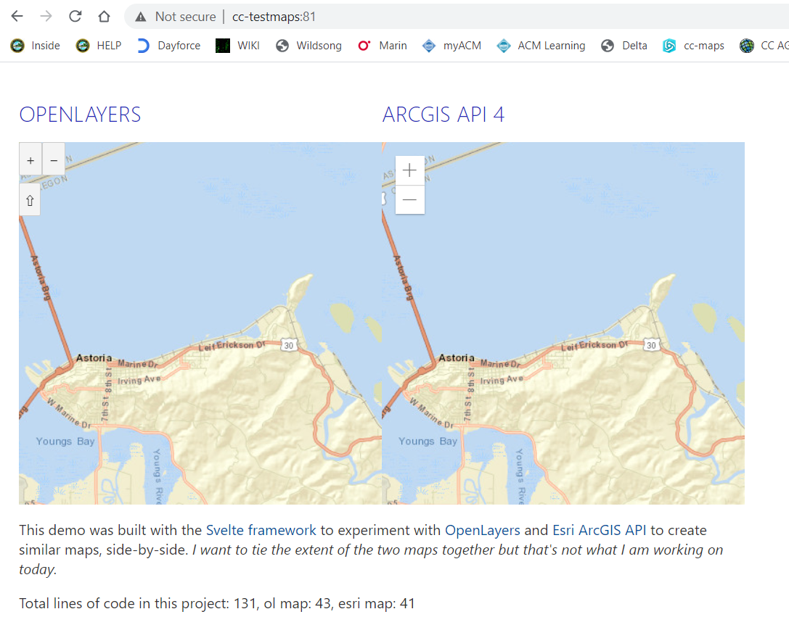

# svelte-maps

This is a demonstration using the Svelte framework
with both the Esri JSAPI 4 and OpenLayers 6. It shows two identical maps side-by-side.

There are no special features; I want to link the extent together but that's not done yet. 
(Scrolling one updates the other, etc.)

I was inspired by a presentation from the Esri Dev Summit.
The original presentation is on YouTube, <https://www.youtube.com/watch?v=Y_EVrWtBnow>

The project was created from the standard svelte project template at <https://github.com/sveltejs/template>.

## Additional help

* <https://esri-svelte-basemaps-example.now.sh/>
* <https://github.com/jwasilgeo/esri-svelte-basemaps-example>

JSAPI reference: <https://developers.arcgis.com/javascript/latest/api-reference/>

OpenLayers reference: <>

Blog: <https://odoe.net/blog/svelte-with-the-arcgis-api-for-javascript/>

## Get started

Install the dependencies. Installing parcel globally seems to work better for me, at least on Windows. 
PATH issue? Whatever. It works, installing in the devDependencies sometimes fails.

```bash
npm install parcel -g
cd svelte-app
npm install
```

Then start it. This should automatically open a browser and connect it to http://localhost:1234
If not something is wrong, maybe you don't have Chrome or something.

```bash
npm start
```

You should see two maps. 



The map you see on top is loading from Rumsey maps. 
There is an Esri basemap underneath each. Pan away from Astoria to see the basemap.
After getting the basemap to load I added the Astoria map from David Rumsey maps using XYZ tiles. 

## Parcel vs Rollup

I bonded with Parcel when I was learning React and I find it very very easy to use, 
so I converted this project from rollup to parcel. Is it faster? Whatever, they both
work, and I have enough to learn with Svelte without having to add a new bundler
at the same time so there you have it.

## Deploying to the web

The Svelte people suggest using Vercel.com or Surge.sh;
probably both fine ideas but I want to keep the content in my own servers.
To me the bundler is there to make deployment simple, so "copy" is a good way to deploy too.

I think for me it's perhaps just an rsync command.

```bash
npm run build
rsync -av dist/* cc-testmaps:docker/nginx/html
```

I have that automated with

```bash
npm run deploy
```

You of course, would have to edit package.json to change the rsync
command because you can't deploy to my server.
